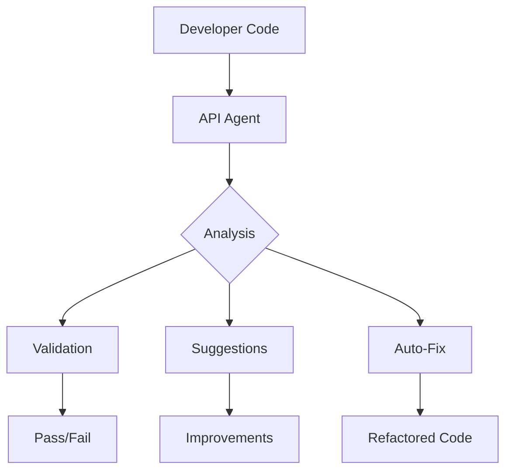

# API Development AI Agent System

## Overview
An intelligent sub-agent that automatically enforces API development principles, reviews code, suggests improvements, and even auto-fixes violations.

## Agent Architecture



## Agent Components

### 1. Core Agent System

```typescript
// lib/agents/api-guardian-agent.ts
import OpenAI from 'openai';
import { analyzeCode } from './code-analyzer';
import { validateApiStructure } from './api-validator';
import { generateSuggestions } from './suggestion-engine';
import { autoFix } from './auto-fixer';

export class APIGuardianAgent {
  private openai: OpenAI;
  private rules: APIRules;
  private context: ProjectContext;
  
  constructor() {
    this.openai = new OpenAI({
      apiKey: process.env.OPENAI_API_KEY
    });
    this.rules = loadAPIRules();
    this.context = loadProjectContext();
  }
  
  async review(code: string, filePath: string): Promise<AgentResponse> {
    // Step 1: Analyze code structure
    const analysis = await this.analyzeCode(code, filePath);
    
    // Step 2: Check against rules
    const violations = await this.checkViolations(analysis);
    
    // Step 3: Generate suggestions
    const suggestions = await this.generateSuggestions(violations);
    
    // Step 4: Attempt auto-fix
    const fixes = await this.generateFixes(violations, code);
    
    // Step 5: Create comprehensive report
    return {
      status: violations.length === 0 ? 'approved' : 'needs-changes',
      violations,
      suggestions,
      fixes,
      refactoredCode: fixes.code,
      explanation: this.generateExplanation(violations, suggestions)
    };
  }
  
  private async analyzeCode(code: string, filePath: string) {
    const prompt = `
      Analyze this API code for architecture compliance:
      
      File: ${filePath}
      Code:
      ${code}
      
      Check for:
      1. Direct Supabase usage vs service layer
      2. Duplicate functionality with existing APIs
      3. Proper error handling
      4. Authentication implementation
      5. REST convention compliance
      6. Performance issues
      
      Return structured analysis in JSON.
    `;
    
    const response = await this.openai.chat.completions.create({
      model: 'gpt-4-turbo-preview',
      messages: [
        { role: 'system', content: 'You are an API architecture expert.' },
        { role: 'user', content: prompt }
      ],
      response_format: { type: 'json_object' }
    });
    
    return JSON.parse(response.choices[0].message.content);
  }
  
  private async generateFixes(violations: Violation[], code: string) {
    if (violations.length === 0) return { code };
    
    const prompt = `
      Fix these API violations automatically:
      
      Violations:
      ${JSON.stringify(violations, null, 2)}
      
      Original Code:
      ${code}
      
      Apply these principles:
      - Use service layer instead of direct Supabase
      - Follow REST conventions
      - Add proper error handling
      - Use consistent authentication
      
      Return the completely refactored code.
    `;
    
    const response = await this.openai.chat.completions.create({
      model: 'gpt-4-turbo-preview',
      messages: [
        { role: 'system', content: 'You are an expert at refactoring code.' },
        { role: 'user', content: prompt }
      ]
    });
    
    return {
      code: response.choices[0].message.content,
      changes: this.diffChanges(code, response.choices[0].message.content)
    };
  }
}
```

### 2. Agent CLI Integration

```typescript
// scripts/api-agent.ts
#!/usr/bin/env node

import { APIGuardianAgent } from '../lib/agents/api-guardian-agent';
import { readFileSync, writeFileSync } from 'fs';
import chalk from 'chalk';
import inquirer from 'inquirer';

const agent = new APIGuardianAgent();

async function main() {
  const args = process.argv.slice(2);
  const command = args[0];
  
  switch (command) {
    case 'review':
      await reviewFile(args[1]);
      break;
    case 'fix':
      await fixFile(args[1]);
      break;
    case 'watch':
      await watchMode();
      break;
    case 'scan':
      await scanProject();
      break;
    default:
      showHelp();
  }
}

async function reviewFile(filePath: string) {
  console.log(chalk.blue(`🤖 API Agent reviewing ${filePath}...`));
  
  const code = readFileSync(filePath, 'utf8');
  const result = await agent.review(code, filePath);
  
  if (result.status === 'approved') {
    console.log(chalk.green('✅ Code approved - follows all API principles!'));
  } else {
    console.log(chalk.yellow('⚠️  Issues found:'));
    
    result.violations.forEach(v => {
      console.log(chalk.red(`  ❌ ${v.message}`));
    });
    
    console.log(chalk.cyan('\n💡 Suggestions:'));
    result.suggestions.forEach(s => {
      console.log(`  • ${s}`);
    });
    
    if (result.fixes) {
      const { confirm } = await inquirer.prompt([{
        type: 'confirm',
        name: 'confirm',
        message: 'Would you like to apply automatic fixes?'
      }]);
      
      if (confirm) {
        writeFileSync(filePath, result.refactoredCode);
        console.log(chalk.green('✅ Fixes applied successfully!'));
      }
    }
  }
}

async function watchMode() {
  console.log(chalk.blue('🤖 API Agent watching for changes...'));
  
  const chokidar = require('chokidar');
  const watcher = chokidar.watch('src/app/api/**/*.ts', {
    ignored: /node_modules/,
    persistent: true
  });
  
  watcher.on('change', async (path) => {
    console.log(chalk.yellow(`\n📝 File changed: ${path}`));
    await reviewFile(path);
  });
}

async function scanProject() {
  console.log(chalk.blue('🤖 Scanning entire project...'));
  
  const glob = require('glob');
  const files = glob.sync('src/app/api/**/*.ts');
  
  const results = {
    total: files.length,
    approved: 0,
    violations: 0,
    fixed: 0
  };
  
  for (const file of files) {
    const code = readFileSync(file, 'utf8');
    const result = await agent.review(code, file);
    
    if (result.status === 'approved') {
      results.approved++;
    } else {
      results.violations++;
      
      if (result.fixes) {
        writeFileSync(file, result.refactoredCode);
        results.fixed++;
      }
    }
  }
  
  console.log(chalk.green(`
  📊 Scan Complete:
  Total Files: ${results.total}
  Approved: ${results.approved}
  Violations: ${results.violations}
  Auto-Fixed: ${results.fixed}
  `));
}

main().catch(console.error);
```

### 3. Git Hook Integration

```bash
#!/bin/bash
# .husky/pre-commit

# Run API Agent on staged files
staged_files=$(git diff --cached --name-only --diff-filter=ACM | grep -E "src/app/api/.*\.ts$")

if [ -n "$staged_files" ]; then
  echo "🤖 API Agent reviewing staged files..."
  
  for file in $staged_files; do
    node scripts/api-agent.js review "$file"
    
    if [ $? -ne 0 ]; then
      echo "❌ API Agent found violations. Please fix before committing."
      exit 1
    fi
  done
  
  echo "✅ All API files passed agent review!"
fi
```

### 4. VS Code Extension Integration

```typescript
// vscode-extension/src/extension.ts
import * as vscode from 'vscode';
import { APIGuardianAgent } from './api-guardian-agent';

export function activate(context: vscode.ExtensionContext) {
  const agent = new APIGuardianAgent();
  
  // Real-time validation
  vscode.workspace.onDidSaveTextDocument(async (document) => {
    if (document.fileName.includes('/api/') && document.languageId === 'typescript') {
      const result = await agent.review(document.getText(), document.fileName);
      
      if (result.violations.length > 0) {
        const diagnostics = result.violations.map(v => {
          return new vscode.Diagnostic(
            new vscode.Range(v.line - 1, 0, v.line - 1, 100),
            v.message,
            vscode.DiagnosticSeverity.Error
          );
        });
        
        diagnosticCollection.set(document.uri, diagnostics);
      }
    }
  });
  
  // Command to fix file
  const fixCommand = vscode.commands.registerCommand('api-agent.fix', async () => {
    const editor = vscode.window.activeTextEditor;
    if (!editor) return;
    
    const result = await agent.review(
      editor.document.getText(),
      editor.document.fileName
    );
    
    if (result.fixes) {
      await editor.edit(editBuilder => {
        const fullRange = new vscode.Range(
          editor.document.positionAt(0),
          editor.document.positionAt(editor.document.getText().length)
        );
        editBuilder.replace(fullRange, result.refactoredCode);
      });
      
      vscode.window.showInformationMessage('✅ API violations fixed!');
    }
  });
  
  context.subscriptions.push(fixCommand);
}
```

### 5. GitHub Actions Integration

```yaml
# .github/workflows/api-agent.yml
name: API Agent Review

on:
  pull_request:
    types: [opened, synchronize]

jobs:
  agent-review:
    runs-on: ubuntu-latest
    
    steps:
      - uses: actions/checkout@v3
      
      - name: Setup Node.js
        uses: actions/setup-node@v3
        with:
          node-version: '18'
          
      - name: Install dependencies
        run: npm ci
        
      - name: Run API Agent
        id: agent
        run: |
          npx tsx scripts/api-agent.ts scan > agent-report.txt
          echo "::set-output name=report::$(cat agent-report.txt)"
        
      - name: Comment PR
        uses: actions/github-script@v6
        with:
          script: |
            const report = `${{ steps.agent.outputs.report }}`;
            
            github.rest.issues.createComment({
              issue_number: context.issue.number,
              owner: context.repo.owner,
              repo: context.repo.repo,
              body: `## 🤖 API Agent Review\n\n${report}`
            });
        
      - name: Auto-fix and commit
        if: github.event.pull_request.head.repo.full_name == github.repository
        run: |
          npx tsx scripts/api-agent.ts fix --all
          
          if [[ $(git status --porcelain) ]]; then
            git config user.name "API Agent"
            git config user.email "api-agent@bot.com"
            git add .
            git commit -m "🤖 API Agent: Auto-fix violations"
            git push
          fi
```

## Agent Capabilities

### 1. Pattern Recognition
- Detects duplicate API logic across files
- Identifies inefficient query patterns
- Recognizes missing abstractions

### 2. Auto-Refactoring
- Converts direct Supabase usage to service layer
- Consolidates duplicate endpoints
- Adds proper error handling
- Implements consistent authentication

### 3. Code Generation
- Generates missing service methods
- Creates proper TypeScript types
- Adds JSDoc documentation
- Implements test cases

### 4. Learning & Adaptation
- Learns from approved patterns
- Adapts to project-specific conventions
- Improves suggestions over time

## Usage Examples

### Example 1: Review Single File
```bash
npm run agent:review src/app/api/users/route.ts
```

### Example 2: Fix All Violations
```bash
npm run agent:fix --all
```

### Example 3: Watch Mode
```bash
npm run agent:watch
```

### Example 4: CI/CD Integration
```yaml
- name: API Agent Review
  run: npm run agent:scan
```

## Implementation Roadmap

### Phase 1: Basic Agent (Week 1)
- [ ] Core review functionality
- [ ] Violation detection
- [ ] Basic suggestions

### Phase 2: Auto-Fix (Week 2)
- [ ] Pattern-based fixes
- [ ] Service layer conversion
- [ ] Error handling addition

### Phase 3: Integration (Week 3)
- [ ] VS Code extension
- [ ] Git hooks
- [ ] CI/CD pipeline

### Phase 4: Advanced Features (Week 4)
- [ ] Learning capabilities
- [ ] Custom rule creation
- [ ] Performance optimization

## Success Metrics

1. **Violation Detection Rate**: > 95%
2. **Auto-Fix Success Rate**: > 80%
3. **Developer Satisfaction**: > 4.5/5
4. **Time Saved**: 50% reduction in code review time
5. **Bug Prevention**: 70% fewer API-related bugs

## Conclusion

This AI sub-agent acts as an automated API architect that:
- **Prevents** violations before they're committed
- **Educates** developers in real-time
- **Fixes** issues automatically
- **Maintains** consistency across the codebase
- **Evolves** with your project needs